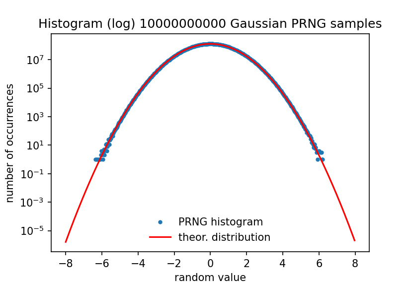

# randommw: Generator of pseudo-random numbers with uniform or Gaussian distribution (in C)


## Description

Numerical simulations for scientific and technological applications regularly require the generation of sequences of (pseudo-)random numbers.[1] This is the case, for instance, for [Monte Carlo methods](https://en.wikipedia.org/wiki/Monte_Carlo_method).[16] Another example is the simulation of the motion of Brownian particles in fluids, where the numbers, in addition to being random, should follow a Gaussian distribution. 

This small C library provides all the basic functionality for such scientific random number generation. It is monolithic: only `randommw.c` and `randommw.h` need to be included in the project, and it does not need any other non-standard library. It is an integrated and curated collection of tried & tested code described in the literature. More background is provided at the end of this README document.

The library includes four different generators of uniformly distributed pseudo-random numbers: MWC256, Xoshiro256+, MELG19937-64 and Splitmix64. These have been reported to pass the relevant statistical tests.[12][14][17] There is a ziggurat algorithm, coded by J. A. Doornik,[9] for obtaining random numbers with a Gaussian distribution. The quality of the generated Gaussian distributions has been checked via their raw moments, following McFarland.[10]

<p align="center">
  
</p>
<p align="center">
  <b>Figure.</b> Histogram (log scale) of 10 billion samples generated by randommw (ZIGNOR with MELG19937-64).
</p>


## Usage

### Minimal example

Here is a minimal example, which only uses two functions: `RanInit()` for initialization and `DRanNormalZig()` for normally-distributed random numbers (full 'double' precision values between 0.0 and 1.0). By default, this uses the MWC256 uniform PRNG, which should be suitable for most applications.

```c
#include <stdio.h>
#include "randommw.h"

int main(void) {
	unsigned int i;
	uint64_t zigseed = 10;
	double rval;
		
	RanInit(zigseed);
	
	for(i = 0; i < 20; i++)	{
		rval = DRanNormalZig();
		printf("%10.6f\n", rval);
	}
	
	return 0;
}

```

### `void RanInit(uint64_t uSeed)`

Initialize the ziggurat algorithm and set the random seed for the underlying random number generator. The default generator is MWC256 (with 52-bit random mantissa for floating point doubles). If a different generator is desired, call `RanSetRan()` before `RanInit()`.

The random seed `uSeed` is always an unsigned 64-bit integer, independently of the specific random number generator. A PRNG-specific routine uses this seed to fully initialize the PRNG.

For seeding the PRNGs randomly, we can use the conventional method using the system time (not entirely recommended in a multiprocessing environment, but good enough for now). This may be done in the following way.

```c
#include <time.h>
#include "randommw.h"

(...)
    // set seed based on time only (good enough for now)
    RanInit((uint64_t)time(NULL));
(...)
```


### `double DRanNormalZig(void)`

Calculate and return the next random number in the normally distributed sequence using the ziggurat algorithm.


### `double DRanU(void)`

Obtain a double-precision floating point random number from a uniform distribution (0, 1) using the active PRNG. Full 52-bit mantissa randomness.


### `uint32_t IranU(void)`

Obtain an unsigned 32-bit integer random number from the active PRNG.


### `void RanSetRan(const char *sRan)`

Choose the uniform pseudo-random number generator that feeds the ziggurat algorithm. At present, the possible choices are `"MWC256"`, `"Xoshiro256+"`,`"MELG19937"` and `"Splitmix64"`. The string is case-sensitive, and should correspond exactly to one of these options; else, your program will crash. 

After calling `RanSetRan()`, you should call `RanInit()` (again). Or, put differently, `RanSetRan()` should be called before `RanInit()`.

### `void RanJumpRan(uint64_t uJumpsize)`

If you use `"Xoshiro256+"` or `"MELG19937"`, you can perform long "jumps" of the generator using `RanJumpRan(uint64_t uJumps)`. Each of the `uJumps` jumps fast-forwards the PRNG by 2^192 (Xoshiro256+) or 2^256 (MELG19937) steps, giving access to an independent stream of random numbers. This mechanism, often called "splitting", is of importance for reliable parallelization of computer simulations.[16] 

Don't jump using a generator that does not support it: your program will brutally crash with a segmentation fault! The Splitmix64 implementation by Vigna used presently in our code does not support jumping/splitting (in spite of its name).


## Compilation, development and testing

At present, the development uses `gcc` exclusively, both on Windows via [mingw-w64](https://www.mingw-w64.org/)/[w64devkit](https://github.com/skeeto/w64devkit) and on standard Linux (64 bit). The code relies on standard C (C99, for the part that is supported by `gcc`). There is a Makefile in the root folder, and a separate Makefile for the test programs in `../tests`.


## Status 

We are working towards basic usage and validation of the PRNG for normally distributed numbers in numerical simulations of colloidal systems. The code is functional and is now contained in a monolithic module (`randommw.c`) that can be easily included in a scientific computing project in C. The random numbers have a good Gaussian distribution (tested up to 8 raw moments, see `tests/test_moments.c`). They are generated with high throughput, using MWC256, Xoshiro256+, MELG19937-64 or Splitmix64 as underlying uniform PRNG.

Generated normally distributed pseudo-random numbers can be written to a binary file using `genzignor.c`. These numbers have been used successfully for Brownian simulations in [DDM Toolkit](https://github.com/mhvwerts/ddm-toolkit), giving consistent results between the simulation and subsequent DDM analysis of the simulated image stack.


### Suggestions for future work

- Add some PNG figures of the plots generated by the Python analysis scripts to illustrate this document.
- The presently used raw moments test (`tests/test_moments.c`) by McFarland [10] should already be quite robust for testing the quality of the Gaussian distribution, but inspiration for additional tests may be found [here](https://cran.r-project.org/web/packages/RcppZiggurat/vignettes/RcppZiggurat.pdf) and [here](https://www.seehuhn.de/pages/ziggurat.html).
- Include programs that explicitly test final quality of randomness of generated normally distributed random numbers. See, e.g., [8] for feeding output to standard random test suites. Also simply test the underlying uniform PRNG, using, *e.g.*, [Lemire's testingRNG](https://github.com/lemire/testingRNG).


## Background

The numerical simulation of the Brownian motion of colloidal nanoparticles needs a source of random numbers. Moreover, these random numbers should have a Gaussian distribution. Computers generate random numbers by specific algorithms. As a result, the numbers generated are not *really* random (they are generated by a deterministic algorithm), but the sequences are (practically) indistinguishable from really random numbers, in terms of statistical properties, and can be used in many numerical applications requiring random numbers. Computer-generated random numbers are *pseudo-random numbers*. 

The choice of the algorithm for the generation of pseudo-random numbers is essential to the success of the numerical simulation.[1] There are many pseudo-random number generators (PRNGs) to choose from and new ones are still appearing.[2] Luckily, there are scientists specialized in testing these PRNGs, and specific test programs for PRNGs have been developed.[3][4][5] However, it is not always very clear to the unsuspecting consumer of PRNGs how to choose. Some developers are going so far as to give the impression that their PRNG algorithm is "the best" and all other algorithms are "not good". There is probably some sociology involved in as to how certain algorithms become the standard PRNG in scientific environments such as Python/numpy, Fortran and Julia. The details about PRNGs are somewhat hidden to the casual user of Python and other high-level languages, yet it is important to be aware and explicit about choosing PRNGs.

The diversity of PRNGs in modern scientific computing is a strength, especially with open source code, and any serious flaw in PRNGs for scientific computing will very likely be detected.[6] Also, it is elusive to look for "the best" PRNG, but one should at least find one that is "good enough" for the particular purpose. A PRNG for Brownian simulation can be good enough, while still failing certain very stringent statistical tests. A look in the literature and discussions with colleagues doing molecular dynamic simulations shows that currently the Mersenne Twister (MT19337) is often used. This does not mean that other generators such as PCG64 and Xoshiro256++ will not work. For instance, we have interchangeably used MT19937 and PCG64 in basic Brownian simulations,[7] with equal success. On the other hand, some older PRNGs have been shown to be of insufficient quality in certain applications such as molecular dynamics or Monte Carlo simulations.[1][6][15]

Standard PRNGs generally generate uniformly distributed random numbers. Since we need a normal distribution for Brownian simulation, the initial uniform should be converted into a random with a Gaussian distribution. There are several ways to do this,[8] with the [Box-Muller transform](https://en.wikipedia.org/wiki/Box%E2%80%93Muller_transform) and the [ziggurat algorithm](https://en.wikipedia.org/wiki/Ziggurat_algorithm) being amongst the most well-known methods. Several modifications of the ziggurat algorithm now exist, improving statistical properties and/or numerical performance.[9][10] 


### Doornik's ziggurat code

A particularly portable, structured and relatively well-documented C code for the generation of normally distributed random numbers is provided by J. A. Doornik.[9] It has been tried and tested independently in the literature.[10] The Doornik code was found to compile and run correctly on both Linux and Windows gcc implementation, and will very likely work with other systems and C compilers. By default, it uses Marsaglias's MWC256 (sometimes called MWC8222) PRNG as the source of a uniform random variable, which is then converted to a random variable with a Gaussian distribution using a ziggurat algorithm. We used the Doornik ziggurat code as the starting point for our development.

In the folder `original_ziggurat_code_doornik` the source code of the original [ZIP archive](https://www.doornik.com/research/ziggurat_code.zip) by Doornik is conserved. The compiled executables from the ZIP file have been removed for security reasons, and the "makefile" folders for gcc have been renamed to emphasize the 32-bit *vs* 64-bit nature of the targeted executables. The file contents have been left intact.

The files necessary for development (`zignor.c`, `zignor.h`, `zigrandom.c` and `zigrandom.h`) have been copied from `original_ziggurat_code_doornik` to the root folder. `zignor` and `zigrandom` were merged into `randommw` and have undergone some changes. The modifications only concern the structure of the code, not the fundamental algorithms. The MWC8222 routines have been renamed to MWC256. The function`DRan_MWC256()` generates random doubles with full 52-bit mantissa resolution (instead of 32-bit in Doornik's original) via two iterations of the MWC256 generator (see [11]).


### Other ziggurat codes

Many implementations of ziggurat algorithms for generation of normally distributed numbers from a uniform PRNG can be found on the Internets. Here are two well-documented and reliable examples.

- [Kschischang](https://www.comm.utoronto.ca/~frank/ZMG/) has made a very nicely documented and well-structured (yet platform-dependent) C implementation of McFarland's 2016 [10] ziggurat algorithm. A copy of Kschischang's code package (`zmg-0.90`) is located in the folder `zmg_kschischang`. In a preliminary (unoptimized) test on Windows (gcc, w64devkit), ZMG (w/ PCG64) performed approx. 2.5x slower than ZIGNOR (w/ MWC256) for generation of large numbers of normally distributed random numbers.

- [Voss](https://www.seehuhn.de/pages/ziggurat.html) provides a concise and well-structured ziggurat code that is part of the GNU Scientific Library ([function `gsl_ran_gaussian_ziggurat()`](https://www.gnu.org/software/gsl/doc/html/randist.html#c.gsl_ran_gaussian_ziggurat) ). It is based on the original algorithm by Marsaglia & Tsang,[13] with some simplifications, and might suffer from the same minor randomness problems.[9]


## References

[1] D. Jones, "Good Practice in (Pseudo) Random Number Generation for
Bioinformatics Applications", http://www0.cs.ucl.ac.uk/staff/d.jones/GoodPracticeRNG.pdf

[2] F. Panneton, P. L'Ecuyer, M. Matsumoto, "Improved long-period generators based on linear recurrences modulo 2", ACM Transactions on Mathematical Software 2006, 32, 1. https://doi.org/10.1145/1132973.1132974

[3] https://www.phy.duke.edu/~rgb/General/dieharder.php

[4] P. L'Ecuyer and R. Simard, "TestU01: A C Library for Empirical Testing of Random Number Generators", ACM Transactions on Mathematical Software 2007, 33, 22.

[5] http://simul.iro.umontreal.ca/testu01/tu01.html

[6] Click, T. H., Liu, A., & Kaminski, G. A., "Quality of random number generators significantly affects results of Monte Carlo simulations for organic and biological systems", Journal of computational chemistry 2011, 32, 513. https://doi.org/10.1002/jcc.21638

[7] [ddm-toolkit @ github]( https://github.com/mhvwerts/ddm-toolkit/blob/045fa3e8819490595d2bd37ccb79bda7330ddbe1/ddm_toolkit/simulation.py#L16C1-L16C1)

[8] D. B. Thomas, P. H. W. Leong, W. Luk, J. D. Villasenor, "Gaussian Random Number Generators", ACM Computing Surveys 2007, 39, 11. doi:10.1145/1287620.1287622. https://www.doc.ic.ac.uk/~wl/papers/07/csur07dt.pdf

[9] J. A. Doornik, "An Improved Ziggurat Method to Generate Normal Random Samples" (2005), https://www.doornik.com/research/ziggurat.pdf

[10] C. D. McFarland, "A modified ziggurat algorithm for generating exponentially and normally distributed pseudorandom numbers", Journal of Statistical Computation and Simulation 2016, 7, 1281. https://dx.doi.org/10.1080/00949655.2015.1060234

[11] J.A. Doornik, "Conversion of High-Period Random Numbers to Floating Point", ACM Trans. Model. Comput. Simul. 2007, 17, 3. https://dx.doi.org/10.1145/1189756.1189759

[12] https://prng.di.unimi.it/

[13] G. Marsaglia and W. W. Tsang, "The Ziggurat Method for Generating Random Variables", Journal of Statistical Software 2000, 5, 1-7. https://doi.org/10.18637/jss.v005.i08

[14] https://github.com/lemire/testingRNG

[15] A.M. Ferrenberg, D. P. Landau, D. P., Y. J. Wong, "Monte Carlo Simulations: Hidden Errors from ‘“Good”’ Random Number Generators", Phys. Rev. Lett. 1992, 69, 3382–3384. doi:10.1103/PhysRevLett.69.3382.

[16] H. Bauke, S. Mertens, "Random Numbers for Large-Scale Distributed Monte Carlo Simulations", Phys. Rev. E 2007, 75, 066701. doi:10.1103/PhysRevE.75.066701.

[17] S. Harase, T. Kimoto, "Implementing 64-Bit Maximally Equidistributed F 2 -Linear Generators with Mersenne Prime Period", ACM Trans. Math. Softw. 2018, 44, 1–11. doi:10.1145/3159444.

